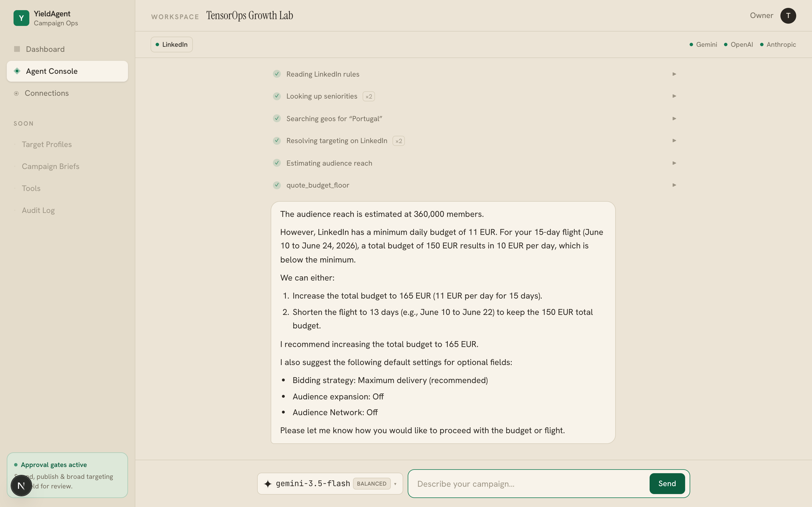
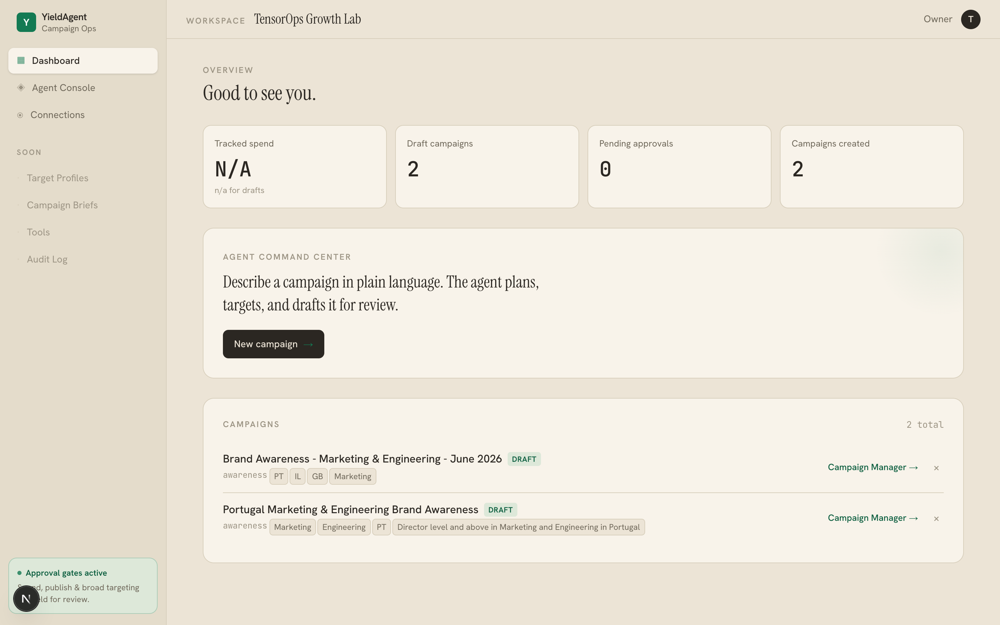
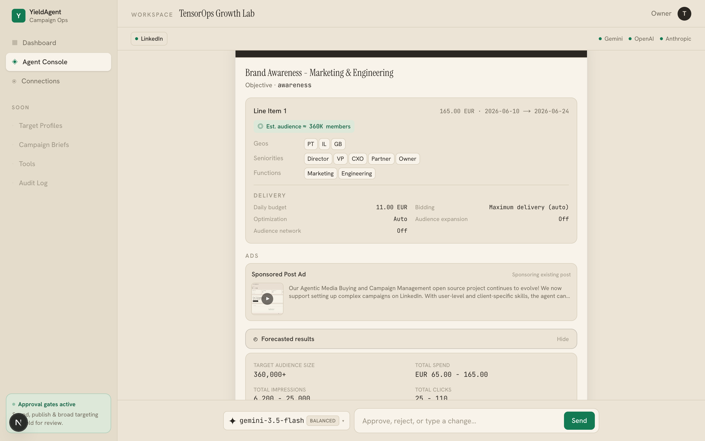

# YieldAgent

**Open-source toolkit for building autonomous agents that run the operational work of adtech** — media buying, campaign setup, and ad operations across both sides of the market.

---

## What it does today

Launch real ad campaigns by **talking to an agent**. Describe a campaign in plain language; the agent confirms the platform, reads its live rules and taxonomy, resolves your targeting, sizes the audience, forecasts results, and drafts the campaign for review. Nothing is written to an ad account until you approve, and even then it only ever creates a **draft** — going live stays a manual click.

The first platform connector is **LinkedIn**, working end to end against a real ad account. The agent, its tools, and the rest of the stack are platform-agnostic by design: Meta, Google, and TikTok plug in behind the same connector contract without changing the agent.

<p align="center">
  
</p>

In the run above, the agent checked the platform, read LinkedIn's rules, resolved *Director and above in Marketing & Engineering across Portugal, Israel, and the UK*, sized the audience at ~360k members, then **caught that 150 EUR over a 15-day flight is 10 EUR/day — below LinkedIn's effective minimum** — and offered to raise the budget or shorten the flight. That check (`quote_budget_floor`) asks LinkedIn for the live per-plan floor, so a campaign that would be rejected at publish gets fixed in the conversation instead.

## See it run

You need an LLM key to chat and LinkedIn credentials to plan/create real drafts. Two terminals:

```bash
# 0. clone + configure
git clone https://github.com/TensorOpsAI/YieldAgent.git && cd YieldAgent
cp .env.example .env        # fill in an LLM key + LinkedIn credentials

# 1. backend (repo root) — FastAPI: chat over SSE + dashboard REST
pip install -e ".[web,linkedin,agent]"
set -a; source .env; set +a
uvicorn api.main:app --reload --port 8000

# 2. frontend (web/) — Next.js console at http://localhost:3000
cd web
nvm use                     # Node 22 (see web/.nvmrc); Next.js 16 needs >= 20.9
npm install                 # first time only
npm run dev
```

Open **http://localhost:3000**, go to **Agent Console**, and describe a campaign. The console picks a model per request (Gemini / OpenAI / Anthropic — whichever keys you set).

<p align="center">
  
  
</p>

The proposal shows the creative preview, the resolved targeting, estimated reach, and a results forecast (spend, impressions, clicks, CTR, CPM) that mirrors LinkedIn's own Campaign Manager numbers. Approve it and the agent creates the campaign as a **DRAFT**; reject it and the agent revises.

## How the agent works

The agent reasons tool-first — the platform's rules, taxonomy, and pricing live in the tools, not in the prompt. It drives a small set of **generic, platform-parameterized tools** through a uniform connector contract, so it never branches on platform:

| Tool | What it does |
|---|---|
| `list_ad_platforms` | which platforms are connected and can create |
| `describe_platform` | the platform's live limits, fields, and defaults |
| `list_targeting_options` / `search_targeting` | the real targeting taxonomy (never invents a value) |
| `preview_targeting` / `estimate_reach` | resolve an audience and size it |
| `quote_budget_floor` | the platform's **live** per-plan budget minimum |
| `propose_campaign` | completeness check, creative + forecast, then pause for human approval |
| `create_draft` | the write step, as a DRAFT, normalized across platforms |

Adding a platform means writing a connector that fills the same contract — the agent and the tools do not change a line. See [`src/yieldagent/connectors/base.py`](src/yieldagent/connectors/base.py).

## Safety model

- **Draft-only.** Every write is created in a non-spending DRAFT state; activation is always a separate manual action on the platform.
- **Human gate.** `propose_campaign` pauses the agent (a LangGraph interrupt) and nothing is created until you approve.
- **Account allowlist.** The LinkedIn client refuses to write to any account not in `LINKEDIN_ALLOWED_AD_ACCOUNTS` unless `YIELDAGENT_ALLOW_LIVE=1` is set explicitly.
- **No guessed values.** Targeting and budget floors come from the platform's own APIs; an unresolved value is reported, never invented.

## Why adtech is agent-shaped

- **API-driven end to end** — every platform exposes the surface agents need.
- **Decisions are scoped and largely reversible** — pause, shift budget, rotate creative.
- **Ground truth is fast** — ROAS, fill rate, CTR, viewability all measurable within hours, so agents are evaluable against real outcomes rather than vibes.

## How it's built — six foundational layers

Every adtech agent in this repo, regardless of role, stands on the same foundation:

1. **Domain model** (`src/yieldagent/domain/`) — a shared, platform-neutral ontology of adtech entities (campaigns, line items, creatives, audiences, KPIs).
2. **Integration layer** (`src/yieldagent/integrations/`) — typed clients and MCP servers over the platforms agents act on. Most of the work lives here.
3. **Connector contract** (`src/yieldagent/connectors/`) — the uniform interface every platform fills so the agent's tools stay platform-agnostic.
4. **Role definitions with scoped authority** — each agent declares what it can *recommend* vs *execute*. The console agent can plan and publish-as-draft; it cannot flip live.
5. **Memory and state** (`src/yieldagent/store/`) — the saved-campaign store behind the dashboard, plus the audit trail for spend-affecting actions.
6. **Human-in-the-loop and audit trail** — approval gates and an immutable log of every spend-affecting action with rationale. Non-negotiable when real money is moving.

## On the same substrate, planned next

| Demand-side | Supply-side |
|---|---|
| More platforms (Meta, Google Ads, TikTok, DV360) behind the same connector | AdOps trafficking (line item QA, creative associations) |
| Budget pacing & in-flight optimization (within scoped bands) | Yield troubleshooting (fill rate, viewability, discrepancies) |
| True multi-platform plans — one intent, per-platform budgets, one approval | Inventory hygiene (orphaned placements, blocklist drift) |
| Performance reporting & anomaly alerts | Deal/PMP setup and monitoring |
| A UI-driving connector (Playwright) for platforms that gate or lack an API | |

## Repository layout

```
src/yieldagent/
  domain/                  # Layer 1 — platform-neutral types (Campaign, LineItem, Ad, Audience...)
  integrations/
    linkedin/              # Layer 2 — LinkedIn client, targeting resolver, diagnostics, MCP server
  connectors/              # Layer 3 — the uniform Connector contract + LinkedIn adapter + registry
  agents/
    console/               # the conversational agent: tools, prompts, runtime (SSE), ReAct graph
  store/                   # Layer 5 — saved-campaign store (SQLite) behind the dashboard
api/                       # FastAPI backend — chat (SSE) + dashboard REST
  main.py                  # app factory
  routes/                  # chat, providers, platforms, campaigns
web/                       # Next.js + Tailwind console (Dashboard, Agent Console, Connections)
docs/                      # architecture + integration docs and the console screenshots
```

## Documentation

- **[LinkedIn integration](docs/linkedin-integration.md)** — client, targeting, diagnostics, env.
- **[Web console (`web/README.md`)](web/README.md)** — frontend specifics and the SSE event contract.

## Status

Early, and shaped in the open. The LinkedIn console is working end to end against a real ad account. The rest of the platform matrix and the supply-side roles are not built yet.

Issues, discussions, and proposals are welcome — especially platform connectors (Meta, Google Ads, TikTok, DV360, GAM) and supply-side workflows.

## License

MIT — see [LICENSE](LICENSE). Copyright (c) 2026 TensorOps.
