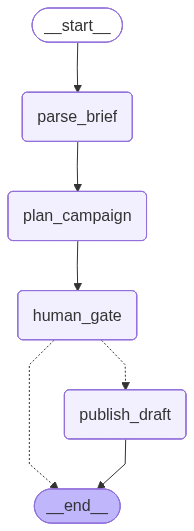

# Campaign-setup agent

The first vertical slice in YieldAgent. Reads a markdown brief, plans a platform-neutral draft `Campaign`, pauses for a human approval decision, and — if approved — publishes the draft to Meta as `PAUSED` objects via the Meta MCP server.

Source: `src/yieldagent/agents/campaign_setup/`.

## Graph topology

The agent is a LangGraph state machine with a single human-in-the-loop interrupt:

<p align="center">
  
</p>

```
START
  └─► parse_brief          (LLM with structured output → Brief)
        └─► plan_campaign  (LLM with structured output → Campaign, forced to draft)
              └─► human_gate     (interrupt; resumed with {approved, reason})
                    ├─► publish_draft   (MCP call → Meta, PAUSED)  ──► END
                    └─► END             (on reject)
```

The PNG above is regenerated by [`notebooks/campaign_setup.ipynb`](../notebooks/campaign_setup.ipynb) — re-run that notebook's render cell after touching the graph wiring.

Each node appends an `AuditEntry` (`node`, `summary`, `detail`) to the `audit` list in state. The audit log is the agent's immutable record of every spend-affecting decision and is printed at the end of every run.

Wiring is in `graph.py:build_graph`; node implementations are in `nodes.py`.

## State

`AgentState` is a `TypedDict` (see `state.py`):

| Field | Type | Set by | Meaning |
|---|---|---|---|
| `brief_text` | `str` | caller | Raw markdown brief input. |
| `brief` | `Brief` | `parse_brief` | Structured brief parsed by the LLM. |
| `campaign` | `Campaign` | `plan_campaign` | Planned draft campaign, always `status='draft'`. |
| `approved` | `bool` | `human_gate` | Operator decision from the interrupt resume payload. |
| `rejection_reason` | `str` | `human_gate` | Free-text reason when not approved. |
| `publish_result` | `dict` | `publish_draft` | IDs returned by the Meta MCP `publish_draft_campaign` tool. |
| `audit` | `list[AuditEntry]` | every node | Append-only action log. |

## Safety guarantees

The slice is the smallest end-to-end exercise of pillars 3, 5 (partially) and 6. Concretely:

- **Drafts are forced.** Even if the LLM ignores the prompt rule and returns `status='active'`, `plan_campaign` overwrites it to `draft` before continuing. See `nodes.py:make_plan_campaign_node`.
- **The publish step only creates `PAUSED` objects.** The Meta MCP client refuses to set anything to `ACTIVE`. Flipping status live is out of scope for the agent — it is a separate human action in Meta Business Manager.
- **The Meta MCP server refuses non-test ad accounts.** Every write tool calls `MetaClient.assert_test_account` first; live accounts require `YIELDAGENT_ALLOW_LIVE=1` to be set explicitly.
- **Approval is structural, not advisory.** The graph cannot transition to `publish_draft` without `human_gate` resuming with `approved=True`. The interrupt is implemented with LangGraph's native `interrupt()` + checkpointer, so a rejected run leaves no partial publish.

## Running

### Interactive (default)

```bash
python -m yieldagent.agents.campaign_setup briefs/example_brief.md
```

The agent prints the planned draft to stdout (JSON) and the audit summary to stderr, then asks `Approve and publish? [y/N]` on stdin. On `y` / `yes` it calls the Meta MCP server and prints the publish result; anything else rejects the draft.

### Dry run (no Meta credentials needed)

```bash
python -m yieldagent.agents.campaign_setup briefs/example_brief.md --dry-run
```

Swaps the Meta MCP server for an in-process stub. The planner LLM still runs (so `ANTHROPIC_API_KEY` is required), the human gate still fires interactively, and the audit trail records everything — but nothing leaves your machine. The stub synthesizes `dryrun_campaign_000` / `dryrun_adset_000` / `dryrun_ad_000` style IDs from the planned `Campaign` so the publish-result shape matches a real run. Use it to:

- try the agent end-to-end before wiring up a Meta test account,
- iterate on brief wording or prompts without burning API quota,
- demo the human gate without risk.

`--dry-run` composes with `--auto-approve` and `--model`. It does **not** require — and intentionally ignores — `META_*` env vars.

### Auto-approve (CI / smoke tests only)

```bash
python -m yieldagent.agents.campaign_setup briefs/example_brief.md --auto-approve
```

Skips the gate. **Never combine with `YIELDAGENT_ALLOW_LIVE=1`** — auto-approve plus live accounts is exactly the failure mode the human gate exists to prevent. (Combining `--auto-approve` with `--dry-run` is fine; nothing reaches Meta either way.)

### Choosing a model

```bash
python -m yieldagent.agents.campaign_setup briefs/example_brief.md --model claude-opus-4-7
```

Default is `claude-sonnet-4-6`. Any Anthropic model that supports structured output works.

## Embedding programmatically

`build_graph` returns a compiled LangGraph application. For tests or alternative front-ends, pass `get_mcp_tool` to swap the Meta MCP server for a fake:

```python
from yieldagent.agents.campaign_setup import build_graph
from langgraph.types import Command

async def fake_get_tool(name):
    class FakeTool:
        async def ainvoke(self, payload):
            return {"campaign_id": "stub", "line_items": [], "ads": []}
    return FakeTool()

graph = build_graph(get_mcp_tool=fake_get_tool)
config = {"configurable": {"thread_id": "test-1"}}

state = await graph.ainvoke({"brief_text": "..."}, config=config)
# state["campaign"] is the planned draft; graph is paused at human_gate.

final = await graph.ainvoke(
    Command(resume={"approved": True, "reason": ""}),
    config=config,
)
# final["publish_result"] contains the (fake) IDs; final["audit"] is the trail.
```

The `thread_id` is what lets the checkpointer resume the paused run — reuse the same value across both `ainvoke` calls.

## Prompts

The two LLM steps use system prompts in `prompts.py`:

- `PARSE_BRIEF_SYSTEM` — extract a `Brief` from free-form markdown. Conservative on unspecified fields (leave null rather than invent).
- `PLAN_CAMPAIGN_SYSTEM` — turn a `Brief` into a `Campaign`. Enforces `status='draft'`, one LineItem per flight unless the brief calls for phasing, and one Ad per creative referencing a LineItem by name.

Iterate prompts here without touching the graph wiring.
